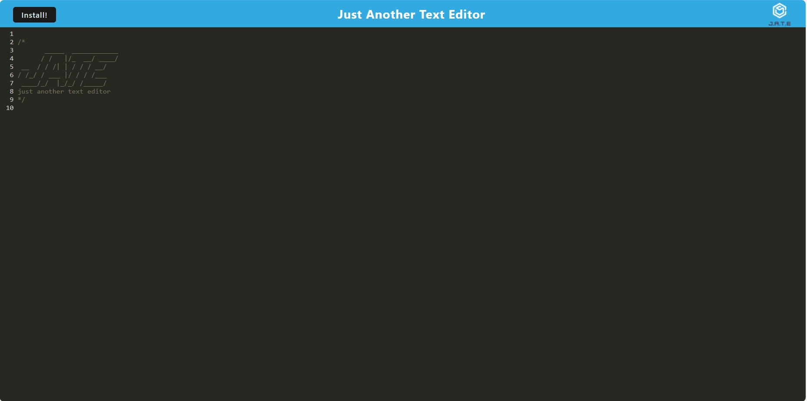

# PWA : Text Editor (Modified Edition)

# Acceptance Criteria
GIVEN a text editor web application
WHEN I open my application in my editor
THEN I should see a client server folder structure
WHEN I run `npm run start` from the root directory
THEN I find that my application should start up the backend and serve the client
WHEN I run the text editor application from my terminal
THEN I find that my JavaScript files have been bundled using webpack
WHEN I run my webpack plugins
THEN I find that I have a generated HTML file, service worker, and a manifest file
WHEN I use next-gen JavaScript in my application
THEN I find that the text editor still functions in the browser without errors
WHEN I open the text editor
THEN I find that IndexedDB has immediately created a database storage
WHEN I enter content and subsequently click off of the DOM window
THEN I find that the content in the text editor has been saved with IndexedDB
WHEN I reopen the text editor after closing it
THEN I find that the content in the text editor has been retrieved from our IndexedDB
WHEN I click on the Install button
THEN I download my web application as an icon on my desktop
WHEN I load my web application
THEN I should have a registered service worker using workbox
WHEN I register a service worker
THEN I should have my static assets pre cached upon loading along with subsequent pages and static assets
WHEN I deploy to Heroku
THEN I should have proper build scripts for a webpack application
Mock-Up

## Instructions

The web application from which the PWA will be created has already been built for you (and was intended to be). The main goal of this homework assignment is to properly set up and configure the web app so it can function as a PWA.

Make sure you post your final work to Heroku. You can use the [Heroku Deployment Guide on The Full-Stack Blog](https://coding-boot-camp.github.io/full-stack/heroku/heroku-deployment-guide) if needed. There is no database component. 

Don't forget to make sure your root package.json file is set up for Heroku.

You will be modifying the files listed below. These are the same files that would need to be modified in the original homework, I've just tried to make things a bit easier to understand. None of the server files need to be touched.

In each file you will see TODO items in the comments. I've tried to give some added texture to each item to help as well.

## How to Test

As you develop, you can run things using `npm start:dev`. When you think you have everything completed, then run `npm start`. This will initiate the build process. The app will then be running on port 3000. You'll see a button in the header of the app where you can install it as a PWA. Try it out!

Once everything works locally, deploy to Heroku and test again. You can even test on a mobile device if you want.

If you need to start from scratch and remove the existing PWA:

- Close the standalone browser window containing the PWA
- Delete the PWA from your hard drive 
- Kill the server session running in VS Code 
- In Chrome, go to localhost:3000, the app may or may not open again. If it does, open up the dev console, go to Application -> Service Workerss and click the **Unregister Worker** link.

Everything below comes from the curriculum README.

# Screenshots

# Links
Github: https://github.com/DewYourWorst/PWA-Deploy
Live: https://pwa-install-41d7b9cefb05.herokuapp.com/

